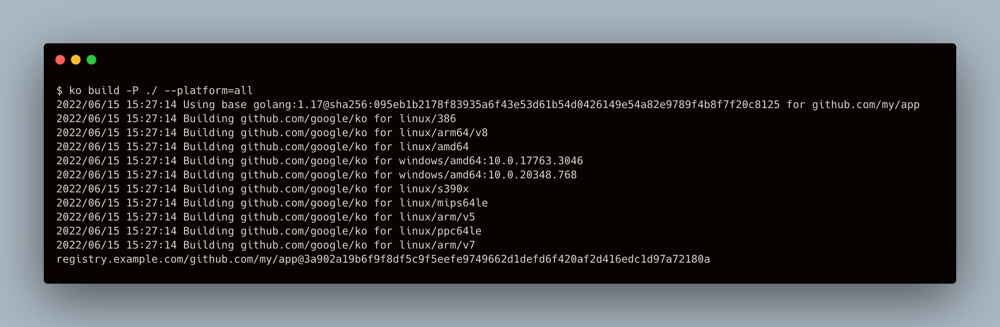

import Bleed from 'nextra-theme-docs/bleed'
import Callout from 'nextra-theme-docs/callout'

# `ko`: Easy Go Containers

`ko` makes building Go container images easy, fast, and secure by default.

<Bleed></Bleed>

`ko` is a simple, fast container image builder for Go applications.

It's ideal for use cases where your image contains a single Go application without many dependencies on the OS base image (e.g., no cgo, no OS package dependencies).

`ko` builds images by executing `go build` on your local machine, and as such doesn't require `docker` to be installed.
This can make it a good fit for lightweight CI/CD use cases.

`ko` also includes support for simple YAML templating which makes it a powerful tool for [Kubernetes applications](./features/k8s).

---

<Callout emoji="🏃">[Install `ko`](./install) and [get started](./get-started)!</Callout>

---

`ko` is used and loved by these open source projects:

- [Knative](https://knative.dev)
- [Tekton](https://tekton.dev)
- [Karpenter](https://karpenter.sh)
- [Sigstore](https://sigstore.dev)

[_Add your project here!_](https://github.com/imjasonh/ko.build/edit/main/pages/index.mdx)